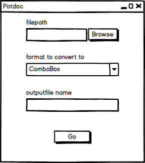
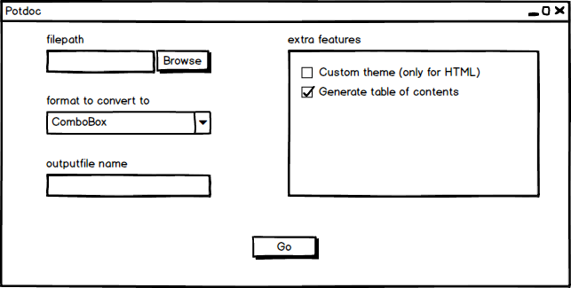
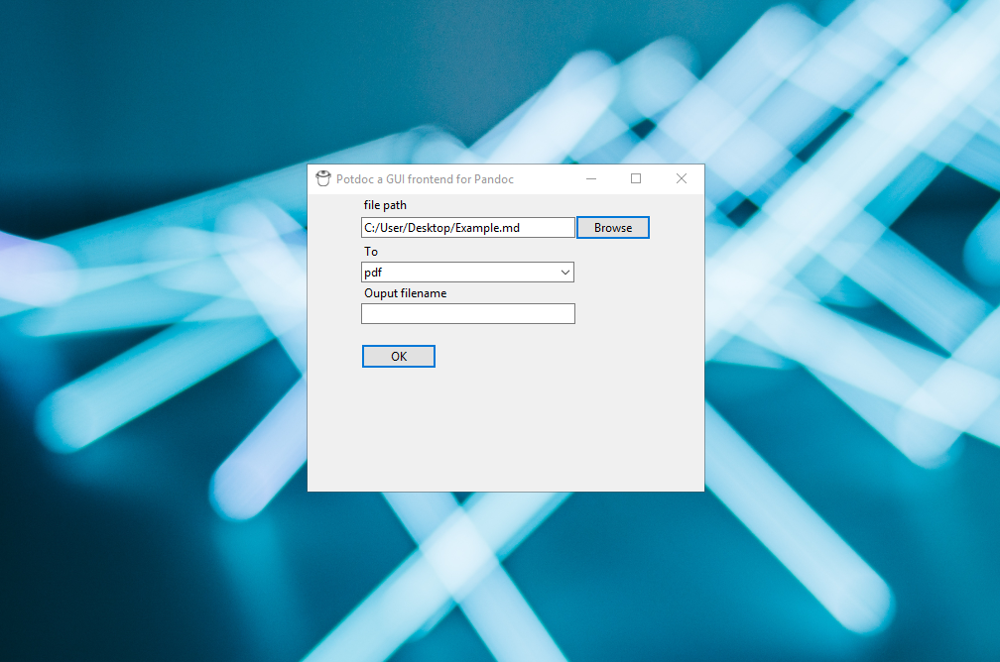

# README
Potdoc is a simple GUI frontend for [Pandoc](https://github.com/jgm/pandoc) written in python using the [Pypandoc](https://pypi.org/project/pypandoc/) and Tkinter packages. 
**NB!** Potdoc is currently in development and not necessarily stable.

# Prerequisites
1. Pandoc must be insatlled and in your ``PATH``. if Pandoc is not installed the Python package [Pydocverter](https://pypi.org/project/pydocverter/) will be used
2. You must have a Pandoc supported LaTeX distribution (I suggest [MikTex](https://miktex.org/) for Windows) installed and in your ``PATH``. You can view [Pandoc.org](https://pandoc.org/installing.html) for more info on setting up Pandoc.
3. [Python 3](https://www.python.org/downloads/) must be installed and in your ``PATH``

# Running
to run Potdoc currently you must run the gui.py file 

# Packages Used
##### Pypandoc
which can be installed by running the following command
````python
pip install pypandoc
````
##### Pydocverter
which can be installed by running the following command
````python
pip install pydocverter
````
##### Tkinter
which is included with python

# Goals/Philosophy
To create a simple GUI program to simplify the use of pandoc for those not [CLI](https://en.wikipedia.org/wiki/Command-line_interface) inclined, that would be for the most part simple to install and use for anyone familiar with LaTeX and Python.

#### Minimum Viable Product


The MVP should be able to:
1. allow user to choose a file
2. allow user to choose output format
3. save the output file in the same directory as the input
4. validate user input and provide helpful error messages
5. infer output file name from input file

#### Final Goal


The final program should be able to:
1. fulfill allthe goals of the MVP
2. allow user to specify additional parameters such as:
   1. allow user to specify a custom css file for HTML output
   2. allow user to add a table of contents
   3. allow advanced users to add filters/additional arguments
3. have a settings menu to change default format and directory
4. pass Pandoc errors to the user if requested

#### Screenshots


# Resources 
the following resources proved helpful in the development of the GUI 
1. [usingpython.com](http://usingpython.com)
2. [effbot.org](http://effbot.org/tkinterbook)
3. [this website](https://infohost.nmt.edu/tcc/help/pubs/tkinter/web/index.html)
4. [This talk on youtube](https://www.youtube.com/watch?v=Wb1YFgHqUZ8)

# Current To Dos:

please see [To DO](todo.md)
